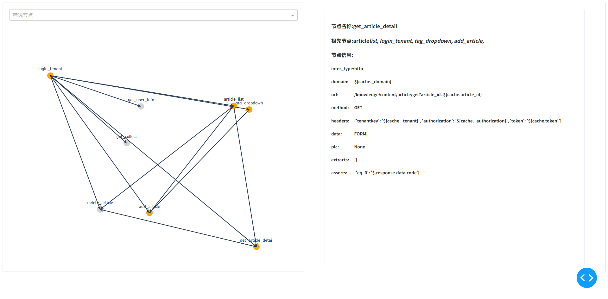
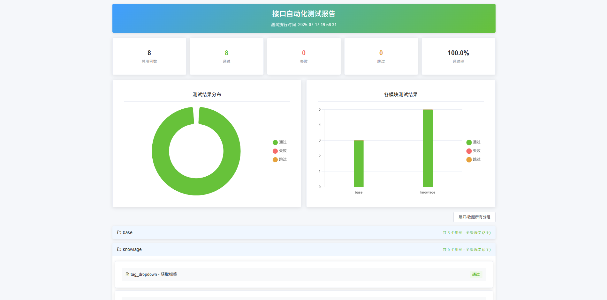

# AuroraTest

AuroraTest 是一个轻量级、功能强大的接口自动化测试框架，专为高效的API测试与验证而设计。它支持自动化调度和执行测试用例，确保API在不同场景下的稳定性与可靠性。

# 框架的优势

1. 支持并发运行
2. 执行打印用例依赖关系图、打印参数化
3. 支持debug指定的测试用例，并根据该条用例自动找出所有的前置用例，并运行
4. 支持逻辑控制器
5. 可以自定义方法，用于获取时间、md5等方法$func{}
6. 将http、ws、sql、redis等定义为测试步骤，而不是前置后置条件
7. 支持失败用例，终止对应的测试流程，后续流程跳过
8. 更好的协议扩展性
    
# 用例结构定义

```yaml
login:
  plc: for _ in range(3)
  inter_type: http
  domain: ${cache._domain}
  url: /auth/oauth2/token
  method: POST
  headers:
    tenantkey: ${cache._tenant}
    authorization: ${cache._authorization}
  data:
    data_type: FORM
    body: grant_type=password&tenantKey=${cache._tenant}&username=${cache._username}&password=${func.hash_password(cache._password)}&captcha=
  extracts:
    token: $.response.data.data.accessToken.tokenValue
  asserts:
    eq_0: $.response.data.code
```
### ASSERT
#### (1) 支持的断言种类
```python
operator_dict = {
    "eq": lambda x, y: str(x) == str(y),
    "neq": lambda x, y: str(x) != str(y),
    "in": lambda x, y: str(x) in str(y),
    "notin": lambda x, y: str(x) not in str(y),
    "gt": lambda x, y: int(y) > int(x),
    "lt": lambda x, y: int(y) < int(x),
    "gte": lambda x, y: int(y) >= int(x),
    "lte": lambda x, y: int(y) <= int(x),
    "isnull": lambda x, y: y is None,
    "regex": lambda x, y: bool(re.search(x, str(y))),
    "start": lambda x, y: str(y).startswith(str(x)),
    "end": lambda x, y: str(y).endswith(str(x)),
    "len": lambda x, y: int(x) == len(y),
    "bool": lambda x, y: bool(y) == bool(x),
}
```
#### (2) 断言写法
__operator_export: extract__
```yaml
your_testcase:
  ...
  ...
  asserts:
    eq_0: $.response.data.code     # 判断字符串是否相等
    gt_10: 提取器的路径    # 判断是否大于int 10
    isnull: 提取器的路径   # isnull 不用添加额外的下划线
    in_hello: 提取器的路径 # 判断字符串是否包含hello
```

### PLC 逻辑循环
#### （1）目的
某些测试用例的结果很可能不是实时返回结果的，这里可以进行循环断言，直到符合所有的断言结果或超出预期时间才结束循环，然后继续运行后面的测试用例
#### （2）循环写法
此处直接使用的python写法
```yaml
your_testcase:
  ...
  plc: for _ in range(10)  # 循环10次
  plc: while True # 无限循环直到超时(60s)或者结果assert正确
  ...
```


# HOOK_FUNC

```python
import base64
from core.hook_base import HookBase


class HookFunc(HookBase):
    case = None  # 这是当前正在执行的测试用例的参数信息，执行对其进行动态修改

    @classmethod
    def add_headers(cls):
        # 对case中的header进行添加"key" 操作
        cls.case.headers["key"] = "value"

    @staticmethod
    def hash_password(password: str) -> str:
        # 这是一个简单的加密示例，可以在编写测试用例时通过 ${func.hash_password("your_password")} 进行引用
        return base64.b64encode(password.encode("utf-8")).decode("utf-8")

    @classmethod
    def before_case(cls) -> None:
        """
        每个用例运行之前运行
        """
        # 对每一个测试用例均进行add_headers操作
        HookFunc.add_headers()

    @classmethod
    def after_case(cls) -> None:
        """
        每个用例运行之后运行
        """
        pass

```

# 快速运行

```python
import hook_func
from core.case.runcase import AsyncRunCase
from core.generate.reader import ReaderCase
from core.cache import ConfigHandler

# 读取case的目录
raw_data = ReaderCase(folder_path="testcase").get_all_cases()

# 读取配置的config文件
config = ConfigHandler()
config.init_config_cache("conf.yaml")

# 钩子函数，用于在测试过程中执行
hk = hook_func.HookFunc

AsyncRunCase(raw_data=raw_data, cache=config.get_config_dict(),
             hook_func=hk).run()

```

# 查看用例关系

```python
from core.generate.generate import TestCaseAutomaticGeneration
from core.generate.graph import HtmlGraph
from core.generate.reader import ReaderCase
from core.utils.path import data_path

raw_data = ReaderCase(data_path("testcase")).get_all_cases()
t = TestCaseAutomaticGeneration(raw_data)
nodes = t.get_all_case_name()
edges = t.get_all_edges()
all_cases = t.get_all_cases()
HtmlGraph(nodes, edges, all_cases).run_server()
```


# 生成测试报告
